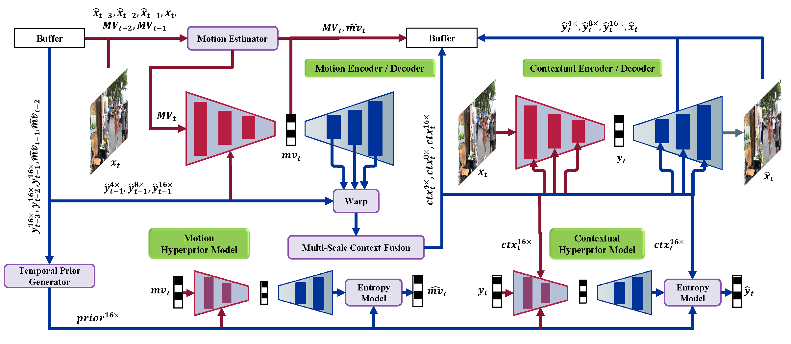

# Accelerating Learned Video Compression via Low-Resolution Representation Learning




## Environment Setup

Install the arithmetic coding module following the [DCVC](https://github.com/microsoft/DCVC) project instructions:


## Training

```bash
CUDA_VISIBLE_DEVICES=${GPU_ID} python train.py \
    -d ${DATA_PATH} \
    -e ${EPOCHS} \
    -lr ${LEARNING_RATE} \
    -n ${NUM_WORKERS} \
    --batch-size ${BATCH_SIZE} \
    --num-frames ${NUM_FRAMES} \
    --cuda \
    --save \
    --seed ${SEED} \
    --clip_max_norm ${CLIP_NORM} \
    --freeze-flownet \
    --freeze-image-model \
    --checkpoint-image-model ${IMAGE_MODEL_CHECKPOINT} \
    --name ${MODEL_NAME} | tee -a logs/${LOG_FILE}
```

## Logs

Training logs are saved in the `logs/` folder. 

## Checkpoints

**Link**: https://pan.baidu.com/s/1tlxVqsj0VBStpg4tKRsutw?pwd=n6wu  
**Extract Code**: n6wu


## Experimental Results


## References

- [DCVC](https://github.com/microsoft/DCVC)
- [CompressAI](https://github.com/InterDigitalInc/CompressAI)